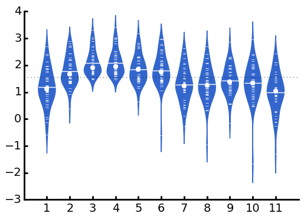
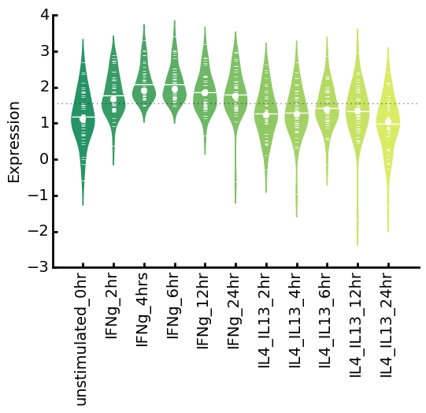
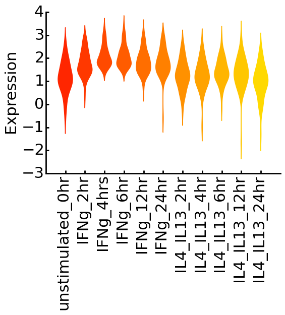
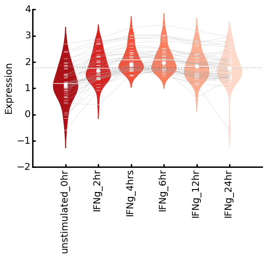

NAME: beanplot
==============

DESCRIPTION
-----------

Simple but customisable beanplots from the command-line via python.

INSTALLATION
------------

Generally speaking you only need a working Python installation and some common python libraries. 
This script was developed using Python 2.7.3.

Local install:
Put this script in the direction where you want to use it and make it executable.

Global install:
Make the script executable and copy it to a directory that is in your PATH variable (e.g. ~/bin):

```bash
$ chmod u+x beanplot
$ cp beanplot ~/bin
#test
$ beanplot -h
```

DEPENDENCIES
------------

* matplotlib
* scipy.stats
* numpy

USAGE
-----

```bash
$./beanplot -h
                [-y STRING] [-x STRING] [--xmax FLOAT] [--xmin FLOAT]
                [--ymax FLOAT] [--ymin FLOAT] [--turn] [--fontsize INT]
                [--linewidthaxis INT] [--connect STRING] [--pheight FLOAT]
                [--pwidth FLOAT] [--noOverallMean] [--overallMedian]
                [--noStrips] [--noMeans] [--noMedians]
                [--stripColor HTMLCOLORCODE]
                [--medianMarkerColor HTMLCOLORCODE]
                [--meanStripColor HTMLCOLORCODE] [--violinColor HTMLCOLORCODE]
                [--multiplecolors COLORMAP]
                FILE

Beanplot for each column of a file.

positional arguments:
  FILE                  Delimited file. [if set to "-" or "stdin" reads from
                        standard in]

optional arguments:
  -h, --help            show this help message and exit
  -v, --version         show program's version number and exit
  -o STRING, --out STRING
                        Outfile. File-ending determines outfile-type, e.g.
                        seb.pdf, will create a PDF.[If not set, interactive
                        mode enabled.]
  -d STRING, --delimiter STRING
                        Delimiter used in file. [default: "tab"]
  -a, --header          Header in File. Header values will be variable names
                        for each beanplot. [Default: False]
  -c INT [INT ...], --columns INT [INT ...]
                        Columns to exclude.

Plot:
  General plotting arguments:

  -y STRING, --ylabel STRING
                        y-label for the beangraph.
  -x STRING, --xlabel STRING
                        x-label for the beanplot.
  --xmax FLOAT          x-axis maximum limit.
  --xmin FLOAT          x-axis minimum limit.
  --ymax FLOAT          y-axis maximum limit.
  --ymin FLOAT          y-axis minimum limit.
  --turn                Turn x-ticklabels by 90 degree to make them readable.
  --fontsize INT        Font-size. [default: 14]
  --linewidthaxis INT   Font-size of axis line-width. [default: 2]
  --connect STRING      HTML-color code,transparency-level to use to connect
                        row-elements to generate line-plot on top of beanplot.
                        e.g. "#A4A4A4,0.15" [default: None]
  --pheight FLOAT       Set the picture-height in inches. [default: 4.]
  --pwidth FLOAT        Set the picture-width in inches. [default: 6.]

Beanplot:
  Beanplot specific arguments:

  --noOverallMean       Turn off overall mean line.
  --overallMedian       Turn on overall median line. [Default: OFF]
  --noStrips            Turn off striplines lines.
  --noMeans             Turn off individual mean lines.
  --noMedians           Turn off individual median points.
  --stripColor HTMLCOLORCODE
                        Set strip color [default: #FFFFFF (white)]
  --medianMarkerColor HTMLCOLORCODE
                        Set median marker color [default: #FFFFFF (white)]
  --meanStripColor HTMLCOLORCODE
                        Set mean strip color [default: #FFFFFF (white)]
  --violinColor HTMLCOLORCODE
                        Set violin color [default: #3366CC (blue)]
  --multiplecolors COLORMAP
                        Colormap (pylab.cm) for plotting violin colors, e.g
                        winter, summer, autumn, rainbow, etc. [default: None].
                        Examples of possible colormaps here: http://wiki.scipy
                        .org/Cookbook/Matplotlib/Show_colormaps

Copyright Sebastian Schmeier (s.schmeier@gmail.com)
```

Examples
--------

Basic beanplot for a tab-separated file with stripchart, one-colored violinplots, dotted line indicating overall mean, white dots indicating individual medians, and longer strips for individual means.

```bash
$ cat test_data.txt | tail -n +2 | ./beanplot - -o test_data1.png
```


First row in the file is a header, use header labels as tick-labels and turn them 90 degree to make them readable, use a matplotlib colormap for creating different colors for each beanplot. Set a y-label.

```bash
$ ./beanplot test_data.txt -a --turn --multiplecolors summer --ylabel Expression -o test_data2.png
```



Different colormap, make font bigger, remove stripchart, means and medians.

```bash
$ ./beanplot test_data.txt -a --turn --multiplecolors autumn --ylabel Expression --fontsize 22 -o test_data3.png --noOverallMean --noStrips --noMeans --noMedians
```



Reading data from stdin. Connect row-elements with a line using the --connect argument. It expects a HTML-color and a transparency-level. This might be useful for connecting e.g. time-course data like in this example.

```bash
$ cat test_data.txt | cut -f 1-6 | ./beanplot - -a --turn --multiplecolors Reds_r --ylabel Expression --connect "#A4A4A4,0.2" -o test_data4.png
```




VERSION HISTORY
---------------

* 0.1.7    2015/09/25    Cleaned code-base.
* 0.1.6    2014/10/08    Added possibility to change the color of the mean strips.
* 0.1.5    2014/09/01    Added possibility to connect row-elements trough a line.
* 0.1.4    2014/08/28    Made x and y axes limits adjustable.
* 0.1.3    2014/08/28    Small bug-fix of x-label display.
* 0.1.2    2014/07/31    Working version.
* 0.1      2014/06/04    Initial version.

